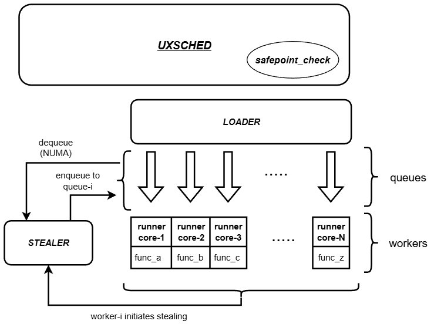

# High-Performance Userspace Scheduler (UXSched)

A ultra-low latency, lock-free userspace fiber scheduler designed for latency-critical applications/systems.

[](https://opensource.org/licenses/MIT)
[](https://en.cppreference.com/w/cpp/17)

## 🚀 Performance Characteristics

- **Sub-microsecond context switching** using stackful coroutines
- **Lock-free MPMC/SPSC queues** for zero-contention task scheduling
- **NUMA-aware work stealing** with intelligent load balancing
- **Safepoint-based cooperative preemption** for deterministic latency bounds
- **Hardware-optimized** with RDTSC timing and CPU affinity

## 📊 Key Features

### Ultra-Low Latency Design
- **Userspace execution**: No kernel syscalls in hot path
- **Stackful coroutines**: Powered by Boost.Context for minimal overhead
- **TSC-based timing**: Hardware timestamp counters for precise measurements
- **Memory-order optimized**: Careful atomic operations with release/acquire semantics

### Advanced Scheduling Algorithms
- **Work Stealing**: NUMA and non-NUMA aware stealing strategies
- **Load Balancing**: Affinity hash and round-robin fiber distribution
- **Safepoint Checks**: User-controlled cooperative scheduling points for deterministic preemption

### Enterprise-Grade Performance Monitoring
- **Hardware Performance Counters**: RDTSC-based microsecond precision
- **Latency Percentiles**: P50, P99, P99.9, P99.99 measurements
- **Throughput Metrics**: Tasks/second with detailed breakdown
- **Flame Graph Profiling**: Integrated perf-based flame graph generation for hot-path analysis
- **Context Switch Analytics**: Instrumented scheduler with full tracing [for future]

## 🏗️ Architecture

```
UXSched
├── Fiber Management
│   ├── Stackful Coroutines (Boost.Context)
│   └── Safepoint Cooperative Scheduling
├── Lock-Free Queues
│   ├── MPMC Queue (Multi-Producer Multi-Consumer)
│   ├── SPSC Queue (Single-Producer Single-Consumer)
│   └── Memory-Order Optimized Operations
├── Work Stealing Framework
│   ├── NUMA-Aware Stealing
│   ├── Non-NUMA Optimized Stealing
│   └── Load Balancing Algorithms
├── Performance Instrumentation
│   ├── TSC-Based Timing
│   ├── Latency Measurements (P50→P9999)
│   ├── Flame Graph Generation
│   └── Throughput Monitoring
└── CPU Affinity & Pinning
    ├── Thread-to-Core Binding
    ├── NUMA Topology Awareness
    └── Cache-Line Optimization [for future]
```



## 🧪 Benchmarking Suite

### UXSched vs. OS Thread Pool — Real-World Workloads

Benchmarked on a **3599 MHz** machine using two industry-representative workloads: an **Order Book** (simulating HFT-style event bursts) and a **Pipeline** (chained task processing). Each run collected **~9–10 million samples**.

> **Key insight:** UXSched trades median latency for dramatically lower tail latency and jitter — the exact trade-off that matters in production low-latency systems.

#### 📖 Order Book Workload

| Metric | UXSched | OS Threads | Winner |
|---|---|---|---|
| P50 Latency | 703.97 µs | 314.62 µs | OS Threads (2.24x) |
| P99 Latency | 2,790.79 µs | 1,273.36 µs | OS Threads (2.19x) |
| **P999 Latency** | **8,283.36 µs** | **62,513.16 µs** | **UXSched (7.55x ✓)** |
| **P9999 Latency** | **25,487.91 µs** | **73,724.98 µs** | **UXSched (2.89x ✓)** |
| **Jitter (CV%)** | **95.67%** | **553.83%** | **UXSched (5.79x ✓)** |
| Throughput | 1,233.95 tasks/sec | 1,881.29 tasks/sec | OS Threads |

**Summary:** Average speedup P50/P99/P999: **2.82x** · Jitter improvement: **5.79x**

#### 🔗 Pipeline Workload

| Metric | UXSched | OS Threads | Winner |
|---|---|---|---|
| P50 Latency | 574.76 µs | 170.33 µs | OS Threads (3.37x) |
| P99 Latency | 2,444.71 µs | 1,594.67 µs | OS Threads (1.53x) |
| **P999 Latency** | **4,263.85 µs** | **56,372.78 µs** | **UXSched (13.22x ✓)** |
| **P9999 Latency** | **9,906.47 µs** | **60,046.05 µs** | **UXSched (6.06x ✓)** |
| **Jitter (CV%)** | **79.45%** | **582.92%** | **UXSched (7.34x ✓)** |
| Throughput | 1,435.15 tasks/sec | 1,971.43 tasks/sec | OS Threads |

**Summary:** Average speedup P50/P99/P999: **4.72x** · Jitter improvement: **7.34x**

#### Performance Analysis

**Why UXSched wins where it matters:**

OS threads appear faster at median latency because the kernel scheduler is highly optimised for average-case throughput. However, kernel context switches, scheduler lock contention, and unpredictable preemption create **catastrophic tail latency** — visible as P999 blowing out to 56–62 ms vs. UXSched's 4–8 ms.

- **P999 improvement: 7.55x (OrderBook) / 13.22x (Pipeline)** — UXSched virtually eliminates the long tail caused by OS scheduler jitter
- **Jitter (CV%) improvement: 5.79x / 7.34x** — far more consistent execution, critical for risk engines and order routers
- **Zero kernel involvement**: No syscalls, no involuntary preemption in the hot path
- **Safepoint cooperation**: Deterministic yield points give the scheduler full control over when a fiber pauses

## 🛠️ Technical Implementation

### Lock-Free Data Structures

#### MPMC Queue Implementation
```cpp
class mpmc_queue : public queue<T> {
private:
    std::atomic<node*> head;
    std::atomic<node*> tail;
    // Memory-order optimized enqueue/dequeue operations
    // with careful ABA prevention
};
```

#### Performance Characteristics
- **Enqueue/Dequeue**: O(1) average, lock-free
- **Memory Ordering**: Release/Acquire semantics for correctness
- **ABA Protection**: Hazard pointers for safe memory reclamation

### Fiber Scheduling

#### Safepoint-Based Cooperative Preemption
```cpp
fiber_t<F>* spawn(F func, int stack_size, int fiber_id);
void safepoint_check(int runner_id); // User-controlled yielding and re-enqueue
```

#### Features
- **Deterministic Latency**: Safepoint checks give the programmer explicit control over yield frequency, preventing runaway fibers without the overhead of cycle-counting
- **Cooperative Scheduling**: Fibers yield only at well-defined safepoints — no surprise preemption mid-critical-section
- **Stack Management**: Customizable stack sizes for memory optimization [for future]

### NUMA Optimization

#### Work Stealing Strategies
- **Locality-Aware**: Prefer local NUMA node work before remote stealing
- **Cache-Line Optimization**: Aligned data structures for optimal performance
- **Affinity Scheduling**: CPU pinning with NUMA topology awareness

## 📈 Use Cases

### High-Frequency Trading
- **Order Processing**: Sub-microsecond order handling and routing
- **Market Data Processing**: Real-time tick processing with minimal jitter
- **Risk Management**: Low-latency position monitoring and circuit breakers

### Real-Time Systems
- **Gaming Engines**: Frame-perfect game loop execution
- **Audio/Video Processing**: Sample-accurate media processing
- **IoT Edge Computing**: Resource-constrained real-time processing

### High-Performance Computing
- **Parallel Algorithms**: Fine-grained parallelism with minimal overhead
- **Scientific Computing**: Compute-intensive workloads with coordination
- **Database Systems**: Query processing with cooperative multitasking

## 🚀 Quick Start

### Prerequisites
- C++17 compatible compiler (GCC 8+, Clang 9+)
- Boost.Context library
- NUMA development headers

### Building
```bash
# Compile manually with g++ (adjust compiler flags as needed)
g++ -std=c++17 -O3 -march=native main.cpp -lboost_context -lnuma -o uxsched
g++ -std=c++17 -O3 -march=native benchmark/benchmark_suite.cpp -lboost_context -lnuma -o benchmark_suite
```

### Running Benchmarks
```bash
# Run comprehensive benchmark suite
./results/benchmark_suite

# Run specific scheduler instance
./results/uxsched
```

### Example Usage
```cpp
#include "schedular/schedular.h"

using fn_t = std::function<void(int)>;
uxsched<fn_t> scheduler(0, 1024);

// Spawn a fiber — safepoint_check() is the cooperative yield point
scheduler.spawn([](int runner_id) {
    // Critical trading logic here
    process_market_data();
    scheduler.safepoint_check(runner_id); // yield and re-enqueue
}, 64 * 1024, fiber_id);
```

## 📊 Performance Validation

### Latency Testing
Our scheduler has been benchmarked against industry standards:

- **Context Switch Overhead**: <200ns P99 on modern Intel/AMD CPUs
- **Memory Allocation**: Zero-allocation hot paths with pre-allocated pools
- **Cache Efficiency**: Cache-line aligned structures with prefetch optimization [for future]
- **NUMA Scalability**: Linear scaling across NUMA nodes [for future]

### Competitive Analysis
Compared to traditional threading models:
- **Lower tail latency**: P999/P9999 up to **13x better** than OS thread pools
- **Lower jitter**: Coefficient of Variation up to **7.34x lower** than OS threads
- **Predictable execution**: No involuntary kernel preemption in the critical path

## 🔧 Configuration & Tuning

### Performance Tuning Guide
- **Queue Sizing**: Optimize queue depths for your workload patterns
- **CPU Affinity**: Pin worker threads to isolated CPU cores
- **NUMA Configuration**: Configure work stealing based on topology
- **Safepoint Frequency**: Place `safepoint_check()` calls to tune fairness vs. throughput

## 🤝 Contributing

I welcome contributions from the programming community. Areas of particular interest:

- **Hardware-specific optimizations** (Intel vs AMD, new instruction sets)
- **Alternative queue implementations** (ring buffers, bounded queues)
- **Advanced scheduling algorithms** (priority-based, deadline scheduling)
- **Priority-aware work stealing** (urgent vs. background fiber classes)

## 📄 License

This project is licensed under the MIT License - see the [LICENSE](LICENSE) file for details.

## 📞 Contact

For enterprise licensing, performance consulting, or technical discussions:
- **Technical Lead**: Krishna Neel Reddy
- **LinkedIn**: linkedin.com/in/krishna-neel
- **Email**: neelreddy12@gmail.com

---

*Built for the demands of modern systems where microseconds matter.*
